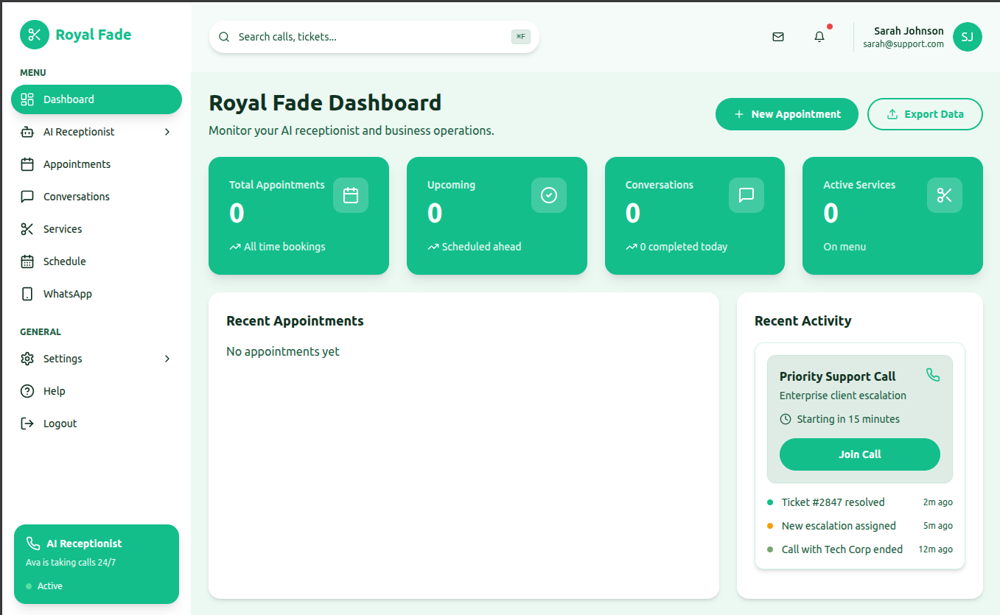
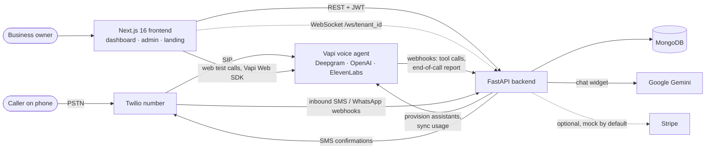

# Calleem — AI voice receptionist for small businesses

[](https://github.com/montaassarr/Calleem/actions/workflows/ci-cd.yml)
**Live:** [calleem.tech](https://calleem.tech)

Calleem answers the phone for barbershops, clinics and other appointment-based businesses. Each business gets its own AI voice agent (built on [Vapi](https://vapi.ai)) that talks to callers, checks real availability, books appointments into the business's calendar and texts the customer a confirmation. Owners manage everything — agent voice and personality, services, appointments, call transcripts — from a multi-tenant web dashboard.



Screen recording: [`frontend_next/public/demo-screencast.webm`](frontend_next/public/demo-screencast.webm)

## Features

- **Voice agent per business** — a Vapi assistant is provisioned for each tenant (Deepgram STT, OpenAI `gpt-4o-mini`, ElevenLabs TTS by default); owners can change voice, personality/prompt, FAQ knowledge base and enabled tools from the dashboard, and place test web calls from the browser.
- **Tool calling into the backend** — during a call the agent calls `checkAvailability`, `bookAppointment`, `getAvailableServices`, `getBusinessLocation` and `getCurrentDateTime`, which run against the tenant's data (timezone-aware) through a verified Vapi webhook.
- **Phone numbers** — a business's Twilio number is connected to its assistant via a Vapi SIP credential; Twilio credentials are stored AES-256-GCM encrypted.
- **Appointments & services** — CRUD, conflict/availability checks, cancellation and summary stats; bookings made by the agent show up in the same calendar.
- **Call history** — end-of-call reports (transcript, duration, summary) are stored per tenant and browsable in the dashboard.
- **SMS confirmations** — after a booking call the customer receives a Twilio SMS confirmation.
- **Multi-tenant SaaS** — JWT auth with roles (owner/admin/super-admin), all data scoped by `tenant_id`, an admin console for tenants, user approval, impersonation and credits.
- **Live call events** — a per-tenant WebSocket endpoint (`/ws/{tenant_id}`, JWT-authenticated) broadcasts call start/end and tool-call events.
- **Landing-page chat widget** — answers product questions using Gemini 2.5 Flash.
- **Hardening** — rate limiting (slowapi), Vapi webhook auth + de-duplication, Twilio signature validation, CSP/security headers on the frontend, secrets only from environment variables.

Work in progress / not production-complete: inbound SMS and WhatsApp messages are received, stored and auto-acknowledged but not yet answered by the AI; billing runs against a mock Stripe service by default (`STRIPE_MOCK_MODE=true`); the dashboard does not consume the WebSocket feed yet (it uses React Query fetching).

## Architecture



- **Frontend** (`frontend_next/`) — Next.js App Router app: marketing site, owner dashboard (`/dashboard`) and super-admin console (`/admin`). Deployed on Vercel.
- **Backend** (`backend/`) — async FastAPI service with Motor (MongoDB). Routers in `routers/`, business logic in `services/`, Pydantic models in `models/`. Deployed as a Docker container.
- **Voice** — telephony, speech and the LLM loop are handled by Vapi; the backend owns the business logic that the agent invokes as tools.

## Tech stack

| Area | Technologies |
|---|---|
| Backend | Python 3.11, FastAPI, Pydantic v2, Motor/MongoDB, python-jose (JWT), passlib, `cryptography` (AES-GCM), slowapi |
| Frontend | Next.js 16 (App Router), React 19, TypeScript, Tailwind CSS 4, shadcn/ui (Radix), Framer Motion, TanStack Query, Zod, Recharts |
| Voice & messaging | Vapi (Web SDK + server webhooks), Twilio (SIP, SMS, WhatsApp), OpenAI via Vapi, Google Gemini |
| Tooling | Docker / Docker Compose, GitHub Actions, pytest, Vitest |

## Run locally

Prerequisites: Python 3.11, Node.js 20+, and MongoDB (e.g. `docker run -d -p 27017:27017 mongo:7`).

**Backend**

```bash
cd backend
python -m venv venv && source venv/bin/activate   # Windows: venv\Scripts\activate
pip install -r requirements.txt
cp .env.example .env
# edit .env: ENVIRONMENT=development, DEBUG=true, and generate SECRET_KEY,
# MASTER_KEY and AGENT_INTERNAL_TOKEN (commands are in the file).
# Vapi / Twilio / Gemini keys are optional — those features are disabled without them.
uvicorn main:app --reload --port 8000     # API docs: http://localhost:8000/docs
```

Create a first login (self-registration requires admin approval):

```bash
python scripts/create_super_admin.py      # reads backend/.env
```

**Frontend**

```bash
cd frontend_next
npm ci
echo "NEXT_PUBLIC_API_URL=http://localhost:8000" > .env.local
npm run dev                               # http://localhost:3000
```

**Docker Compose** — alternatively copy `.env.example` to `.env` at the repo root, fill in `MONGO_ROOT_PASSWORD`, `SECRET_KEY`, `MASTER_KEY`, `AGENT_INTERNAL_TOKEN`, set `CORS_ORIGINS=http://localhost:3000` for local use, then run `docker compose up --build` to start MongoDB, the backend (`:8000`) and the frontend (`:3000`). `./start.sh` wraps both modes on Linux/macOS.

Receiving calls locally requires a public URL for the Vapi webhooks (`BACKEND_URL`), e.g. via a tunnel.

## Tests & CI

```bash
cd backend && pytest tests            # security-focused unit tests (auth guards, webhook verification, encryption, config)
cd frontend_next && npm test          # Vitest: auth schemas, API client, security headers
```

The [GitHub Actions pipeline](.github/workflows/ci-cd.yml) runs on every push: backend install + import check, frontend lint and production build, and Docker builds for both services.

## Project structure

```
backend/
  main.py            FastAPI app, middleware, router registration
  routers/           REST, webhook (Vapi, Twilio) and WebSocket endpoints
  services/          Vapi, Twilio, appointments, assistants, billing, Gemini chat
  models/            Pydantic models
  utils/             config, JWT/security, AES-GCM encryption
  tests/             pytest suite
frontend_next/
  app/               App Router pages: landing, /dashboard, /admin
  components/        UI (shadcn/ui), dashboard, landing, Vapi provider
  lib/, hooks/, contexts/   API client, types, React Query hooks, auth/tenant state
  __tests__/         Vitest suite
docs/                architecture notes and business documents
scripts/             admin bootstrap and smoke-test scripts
docker-compose.yml   MongoDB + backend + frontend (+ optional nginx/monitoring profiles)
```

## Author

Montassar Tantouch · [montassartantouch.me](https://montassartantouch.me) · [linkedin.com/in/montassar-tantouch](https://linkedin.com/in/montassar-tantouch)
